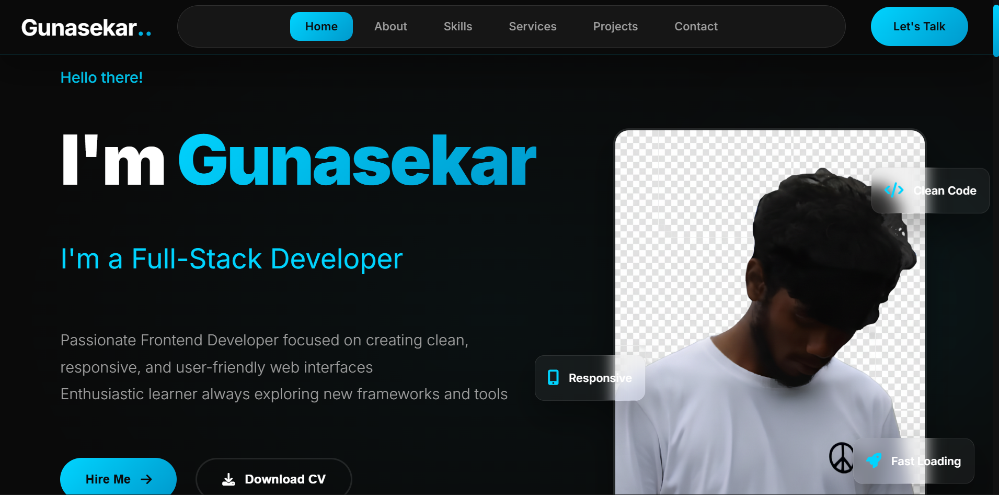

# 👨‍💻 Gunasekar's Portfolio

A modern, responsive personal portfolio website showcasing my skills, projects, and experience as a Full-Stack Developer.



---

## 📋 Table of Contents

- [👨‍💻 Gunasekar's Portfolio](#-gunasekars-portfolio)
  - [📋 Table of Contents](#-table-of-contents)
  - [👤 About](#-about)
  - [✨ Features](#-features)
  - [🛠️ Tech Stack](#️-tech-stack)
  - [📑 Sections](#-sections)
  - [🚀 Getting Started](#-getting-started)
    - [Prerequisites](#prerequisites)
    - [Installation](#installation)
  - [📂 Projects](#-projects)
  - [📞 Contact](#-contact)
  - [📄 License](#-license)

---

## 👤 About

Hi, I'm **Gunasekar**! Passionate Full-Stack Developer skilled in Python, Django, SQL, and modern frontend technologies including HTML, CSS, JavaScript, and React. I focus on building clean, responsive, and scalable web applications.

---

## ✨ Features

| Feature | Description |
|---------|-------------|
| 📱 **Fully Responsive** | Optimized for mobile, tablet, and desktop devices |
| 🎨 **Modern UI/UX** | Clean, minimalistic design with smooth animations |
| 🚀 **Interactive Elements** | Dynamic content and engaging user interactions |
| 📊 **Smooth Scrolling** | Seamless navigation between sections |
| ⚡ **Fast Performance** | Lightweight and optimized for speed |
| 🔗 **Social Integration** | Connect via WhatsApp, LinkedIn, and GitHub |

---

## 🛠️ Tech Stack

<div align="center">


</div>

---

## 📑 Sections

1. **🏠 Home** – Hero section with introduction and call-to-action buttons
2. **👨‍💼 About** – Personal background and professional journey
3. **🛠️ Skills** – Technical skills and expertise
4. **🎯 Services** – Services offered
5. **📂 Projects** – Showcase of completed work
6. **📞 Contact** – Get in touch

---

## 🚀 Getting Started

### Prerequisites

- A modern web browser (Chrome, Firefox, Safari, Edge)
- Text editor (VS Code recommended)

### Installation

1. **Clone the repository**
   ```bash
   git clone https://github.com/guna0223/portfolio.git
   ```

2. **Navigate to the project directory**
   ```bash
   cd portfolio
   ```

3. **Open in browser**
   - Open `index.html` directly in your browser, or
   - Use a live server extension in VS Code

---

## 📂 Projects

| Project | Description | Tech Stack |
|---------|-------------|------------|
| 🌤️ **Weather App** | Real-time weather forecasting application | HTML, CSS, JavaScript |
| 🎬 **Movie App** | Movie database with search functionality | HTML, CSS, JavaScript |
| 💬 **WhatsApp Clone** | WhatsApp web interface clone | HTML, CSS, JavaScript |
| 🎮 **Game App** | Interactive browser-based game | Django full-stack |

---

## 📞 Contact

<div align="center">

[](https://web.whatsapp.com/)
[](https://www.linkedin.com/in/gunasekar0223/)
[](https://github.com/guna0223)

</div>

---

## 📄 License

This project is licensed under the MIT License.

---

<div align="center">

Made with ❤️ by **Gunasekar**

</div>
